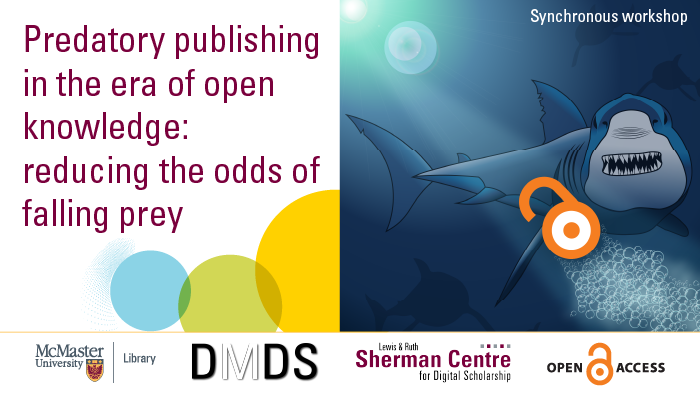

# Welcome to Predatory Publishing in the Era of Open Knowledge: Reducing the Odds of Falling Prey

Thinking about where to publish?  Do you receive random invitations to submit your work for publications? Don’t get caught publishing in a questionable journal!  This virtual workshop provides an overview of what predatory journals are and tips on how to avoid them.  The co-presenters, Neera Bhatnagar and Olga Perkovic, also include suggestions on how to avoid predatory conferences. 

Proceed to the [Workshop Recording](instructions) page to get started.

